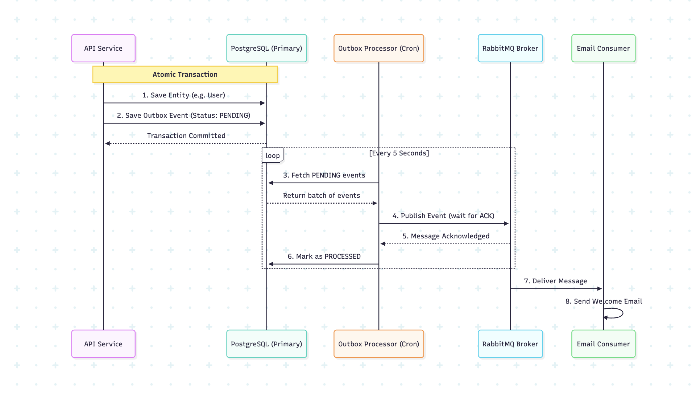

## Table of Contents

1. [Introduction](#superchef)
2. [Routes](#routes)
3. [Authentication & Security](#authentication--security)
   - [JWT-based Authentication](#jwt-based-authentication)
   - [Role-Based Access Control (RBAC)](#role-based-access-control-rbac)
   - [Route Protection](#route-protection)
   - [Rate Limiting](#rate-limiting)
4. [Observability & Distributed Tracing](#observability--distributed-tracing)
5. [Async Processing with RabbitMQ](#async-processing-with-rabbitmq)
   - [Event-driven Architecture](#event-driven-architecture)
   - [Producers & Consumers Separation](#producers--consumers-separation)
6. [Caching (Redis)](#caching-redis)
7. [User Preferences](#user-preferences)
8. [AI Recipe Assistant](#ai-recipe-assistant)
9. [Analytics](#bar_chart-analytics)
10. [Database Transactional Outbox Pattern](#outbox_tray-database-transactional-outbox-pattern)
11. [Project setup](#project-setup)
12. [Environment variables](#environment-variables)
13. [Compile and run the project](#compile-and-run-the-project)
14. [Run tests](#run-tests)
15. [Deployment](#deployment)
16. [License](#license)


## SuperChef

<p align="center">
  
</p>

<table border="0" cellspacing="0" cellpadding="0" style="border-collapse: collapse; border: none;">
  <tr>
    <td></td>
    <td></td>
    <td></td>
    <td></td>
    <td></td>
    <td></td>
  </tr>
</table>

SuperChef is an AI-powered chef assistant designed to analyze existing recipes, suggest meaninful improvements, and help you create better dishes using your current ingredients.

It works on top of your current database, providing practical, cooking-focused recommendations rather than generic advice.

TLDR features:

- Real world backend concerns
- Async workflows
- Security best practices
- Clean NestJS architecture
- Pragmatic use of message queue

## :electric_plug: Routes

All API endpoints are documented using **Swagger (OpenAPI)**.

Once the application is running, the interactive API documentation is available at:

- `GET /apis`

The Swagger UI provides request/resoponse schemas, parameters, and example payloads for each endpoint.

Below is a high level overview of the available routes:

<table>
  <thead>
    <tr>
      <th>Verb</th><th>Resource</th><th>Description</th><th>Scope</th><th>Role Access</th>
    </tr>
  </thead>
  <tbody>
    <tr>
      <td>POST</td><td>/auth/login</td><td>Superchef sign in</td><td>Public</td><td>Admin, Viewer</td>
    </tr>
    <tr>
      <td>POST</td><td>/auth/refresh</td><td>Token refresh</td><td>Protected</td><td>Admin, Viewer</td>
    </tr>
    <tr>
      <td>POST</td><td>/auth/logout</td><td>Sign out</td><td>Protected</td><td>Admin, Viewer</td>
    </tr>
    <tr>
      <td>GET</td><td>/ingredients</td><td>Get ingredients list</td><td>Protected</td><td>Admin, Viewer</td>
    </tr>
    <tr>
      <td>GET</td><td>/ingredients/:id</td><td>Get a single ingredient</td><td>Protected</td><td>Admin, Viewer</td>
    </tr>
    <tr>
      <td>POST</td><td>/ingredients</td><td>Create an ingredient</td><td>Protected</td><td>Admin, Viewer</td>
    </tr>
    <tr>
      <td>PUT</td><td>/ingredients/:id</td><td>Update an ingredient</td><td>Protected</td><td>Admin, Viewer</td>
    </tr>
    <tr>
      <td>DELETE</td><td>/ingredients/:id</td><td>Delete ingredient</td><td>Protected</td><td>Admin, Viewer</td>
    </tr>
    <tr>
      <td>GET</td><td>/recipes</td><td>Get the recipes list</td><td>Protected</td><td>Admin, Viewer</td>
    </tr>
    <tr>
      <td>GET</td><td>/recipes/:id</td><td>Get a single recipe</td><td>Protected</td><td>Admin, Viewer</td>
    </tr>
    <tr>
      <td>POST</td><td>/recipes</td><td>Create a recipe</td><td>Protected</td><td>Admin, Viewer</td>
    </tr>
    <tr>
      <td>PUT</td><td>/recipes/:id</td><td>Update a recipe</td><td>Protected</td><td>Admin, Viewer</td>
    </tr>
    <tr>
      <td>DELETE</td><td>/recipes/:id</td><td>Delete a recipe</td><td>Protected</td><td>Admin, Viewer</td>
    </tr>
    <tr>
      <td>GET</td><td>/users</td><td>Get users list</td><td>Protected</td><td>Admin</td>
    </tr>
    <tr>
      <td>GET</td><td>/users/:id</td><td>Get a single user</td><td>Protected</td><td>Admin</td>
    </tr>
    <tr>
      <td>POST</td><td>/users</td><td>Create a user</td><td>Protected</td><td>Admin</td>
    </tr>
    <tr>
      <td>PUT</td><td>/users/:id</td><td>Update a user</td><td>Protected</td><td>Admin</td>
    </tr>
    <tr>
      <td>DELETE</td><td>/users/:id</td><td>Delete a user</td><td>Protected</td><td>Admin</td>
    </tr>
    <tr>
      <td>POST</td><td>/chat</td><td>Sends a message to the superchef agent</td><td>Protected</td><td>Admin</td>
    </tr>
    <tr>
      <td>GET</td><td>/analytics/top-recipes</td><td>Get the top ten most improved recipes</td><td>Protected</td><td>Admin, Viewer</td>
    </tr>
  </tbody>
</table>

## :shield: Authentication & Security

#### JWT-based Authentication

- Stateless authentication using JWT access tokens
- Tokens are issued on login and required for protected routes
- Designed to be compatible with API clients and frontends.
- Refresh tokens, enabling token rotation and secure session renewal without re-authentication.

#### Role-Based Access Control (RBAC)

- Users can have one or more roles
- Example roles:
  - admin
  - viewer

RBAC is applied at the route level, ensuring fine grained authorization.

#### Route Protection

- Global authentication guard ensures all protected routes require a valid JWT.
- Public routes are explicitly marked.
- Authorization logic is separated from controllers.

#### Rate Limiting

- Built-in rate limiter to protect the API from abuse.
- Prevents excessive requests to sensitive endpoints
- Configurable limits per route or globally.

## :flashlight: Observability & Distributed Tracing

This project implements a high-level observability pattern using [OpenTelemetry](https://opentelemetry.io/) and [Honeycomb](https://www.honeycomb.io/). Instead of traditional isolated logs, we use Distributed Tracing to correlate every log entry with a specific request flow.

#### Key Features
- **Log Correlation:** Every log entry is automatically enriched with a traceId and spanId, allowing for end-to-end debugging.

- **Span Events:** Application logs are pushed to Honeycomb as "Span Events," providing a millisecond-accurate timeline of events within a request.

- **Automatic Context Propagation:** Tracing context is maintained across asynchronous boundaries and distributed systems (e.g., RabbitMQ).

- **Custom Telemetry Logger:** A specialized Logger extends the NestJS ConsoleLogger to handle tracing logic without polluting the Business Logic.

<p align="center">
  
</p>

#### How to use

The system is designed to be transparent for developers. Simply use the standard NestJS Logger service:

```typescript
private readonly logger = new Logger(AuthService.name);

async handle() {
  this.logger.log('User logged in'); // Automatically appears in Honeycomb's trace timeline
}
```

#### Monitoring Dashboard

Traces, errors, and performance metrics are available in Honeycomb. Search by traceId to see the full "waterfall" view of any operation.

## :rabbit2: Async Processing with RabbitMQ

#### Event-driven Architecture

- RabbitMQ is used to handle async workflows
- Examples:
  - User registration triggers a welcome email
  - Extensible to notifications

#### Producers & Consumers Separation

- API publishes domain events
- Workers consume and process them independently
- Designed to be monolith-friendly, without premature microservices.

## :brain: Caching (Redis)

Superchef uses [Redis](https://redis.io/) as an in-memory cache to reduce latency and decrease load on the primary database.

The cache is applied to read-heavy endpoints, which keeps [PostgreSQL](https://www.postgresql.org/) as the single source of thruth while improving response times for frequent reads.

## :gear: User Preferences

Each user can configure dietary preferences that are stored as JSON object inside the user table.
Suported fields:
- `diet`: "none" | "vegetarian" | "vegan" | "omnivore"
- `alergies`: string[]

## :robot: AI Recipe Assistant

Superchef includes an AI-powered assistant via the `/chat` endpoint, that helps users improve existing recipes by suggesting variations, optimizations, or substitutions based on natural language prompts.

The assistant is implemented as a backend agent powered by OpenAI and orchestrated server side.

All suggestions are generated in the context of a real recipe stored in the database.

## :bar_chart: Analytics

This module handles the processing and delivery of recipe popularity metrics using a decoupled, event-driven architecture. By offloading analytics from the main API, we ensure high performance and system resilience.

#### Architecture Overview

The system implements separation of concerns by decoupling read and write operations through an event bus:

1. **Ingestion:** Every time a recipe is improved through the ai agent, a `recipe.improvement` event is published to kafka.
2. **Processing:** The analytics microservice reads this event and performs an atomic increment in redis.
3. **Consumption:** The api retrieves the ranking by talking to the analytics microservice through a rpc-like request, fetching the pre-aggregated data from redis.

For better understanding you can find the detailed process in the imagen below:

<p align="center">
  
</p>

#### Specification

GET `/analytics/top-recipes`

- Retrieves the top ten most improved recipes.

Sample response:

```json
[
  { "id": "uuid-101", "name": "Classic Lasagna", "count": 245 },
  { "id": "uuid-202", "name": "Spicy Ramen", "count": 189 }
]
```

## :outbox_tray: Database Transactional Outbox Pattern

When a user is created in the system two things happen:

1. A new record is created in the users table respectively.
2. A welcome email is dispatched to the user's inbox.

This alone, could be a problem and lead to data inconsistencies, for example, it could be the case that the user is created successfully in our database but the message broker for whatever reason goes down precisely at that moment and the message is not delivered.

How do we mitigate this ?

By adding a transactional outbox pattern, this is how it works:

1. There's a table holding the outbox events:

  ```typescript
  model OutboxEvent {
    id          String   @id @default(uuid())
    topic       String
    payload     Json
    status      OutboxStatus @default(PENDING)
    error       String?
    attempts    Int      @default(0)
    createdAt   DateTime @default(now()) @map("created_at")
    updatedAt   DateTime @default(now()) @map("updated_at")

    @@index([status, createdAt])
    @@map("outbox_event")
  }
  ```

  Creating the user is done by means of a transaction, this transaction involves updating both the user table and the outbox_event table.

2. There's a cron job checking the outbox_event table every `5` seconds. 

- If there's a `PENDING` event it will try to send it to the message broker so it can be processed. 
- If the processing fails and the third attempt hasn't been reached the status remains `PENDING` and the attempts count bumps up.
- If it's the third attempt and the processing fails the status is updated to `FAILED`.

You can check the entire flow in the image below.

<p align="center">
  
</p>

## Database Scaling

As a first measure to horizontally scale the persistence layer two instances of the PostgreSQL database are present, the primary node and the replica. Separating the reading conexions from the writting ones.

This was easy to implement with Prisma through the extension `extension-read-replicas`

## :credit_card: Stripe Integration

Superchef integrates with Stripe for subscription management, allowing users to subscribe to a basic plan and access enhanced features.

#### Features

- Checkout Session Creation: Create Stripe Checkout sessions for subscription purchases
- Webhook Processing: Handle Stripe webhook events (checkout.session.completed)
- Subscription Management: Automatically update subscription status and billing periods
- Customer Management: Create and manage Stripe customers linked to user accounts

#### Supported Webhook Events

| Event                           | Description                     | Action                                                       |
| ------------------------------- | ------------------------------- | ------------------------------------------------------------ |
| `checkout.session.completed`    | Checkout completed successfully | Updates subscription status, billing period, and user access |
| ------------------------------- | ------------------------------- | ------------------------------------------------------------ |
| `customer.subscription.deleted` | Customer unsubscribed.          | Updates subscription status, billing period, and user access |
| ------------------------------- | ------------------------------- | ------------------------------------------------------------ |
| `invoice.paid`                  | Invoice paid successfully.      | Updates subscription status, billing period, and user access |
| ------------------------------- | ------------------------------- | ------------------------------------------------------------ |
| `invoice.payment.failed`.       | Invoice Payment Failed          | Updates subscription status, and notifies the user.          |

## Project setup

```bash
$ npm install
```

## :closed_lock_with_key: Environment variables

Create a `.env` file in the root of your project and add the following env vars:

```bash
DATABASE_URL=
OPENAI_API_KEY=
RESEND_API_KEY=
JWT_SECRET=
LOG_LEVEL=["log", "error", "warn", "debug", "verbose"]
REDIS_HOST=
REDIS_PORT=
REDIS_USERNAME=
REDIS_PASSWORD=
STRIPE_API_KEY=
HONEYCOMB_API_KEY=
```

## Compile and run the project

```bash
# development
$ npm run start

# watch mode
$ npm run start:dev

# production mode
$ npm run start:prod
```

## Run tests

```bash
# unit tests
$ npm run test
```

## Deployment

When you're ready to deploy your NestJS application to production, there are some key steps you can take to ensure it runs as efficiently as possible. Check out the [deployment documentation](https://docs.nestjs.com/deployment) for more information.

If you are looking for a cloud-based platform to deploy your NestJS application, check out [Mau](https://mau.nestjs.com), our official platform for deploying NestJS applications on AWS. Mau makes deployment straightforward and fast, requiring just a few simple steps:

```bash
$ npm install -g @nestjs/mau
$ mau deploy
```

With Mau, you can deploy your application in just a few clicks, allowing you to focus on building features rather than managing infrastructure.

### License

This project is licensed under the MIT License - see the [LICENSE](LICENSE) file for details.
